# Root

  

  <strong>Web Engineer / Quiz Player</strong>

  Astronomy · Physics · Quiz · Software

---

## 👋 About

**Root（astro-root）**

茨城県立水戸第一高等学校3年。同校クイズ研究同好会（M1QC）に所属しています。

Web開発とクイズを中心に活動しています。

思いついたものを、実際に使えるサービスとして形にすることが好きです。

クイズ・学習・業務支援などのWebサービスを個人で開発しています。

また、天文学・物理学にも興味があります。

---

## 🚀 Main Projects

| Project                                       | Description          |
| --------------------------------------------- | -------------------- |
| 🌌 [Root's Lab](https://astro-root.com/)      | 個人開発・活動の拠点           |
| 🏆 [Q-Score](https://q-score.astro-root.com/) | クイズ大会の運営・得点管理ツール     |
| 🧩 [Q-Room](https://q-room.astro-root.com/)   | クイズイベント向けツール         |
| 📅 [ShiftLink](https://shift.astro-root.com/) | シフト・スケジュール管理サービス     |
| 📖 [めくる](https://mekuru.astro-root.com/)      | 間隔反復を取り入れたクイズ型学習サービス |

---

## 🔭 Current Focus

### Qraft

**クイズ専用作問エディタ**

問題を単なる文章ではなく「問題オブジェクト」として扱い、

* 作問
* 編集
* 問題データ管理
* 共有
* 共同作業

を行える環境を開発しています。

現在は UI / UX・データモデル・エディタ設計・共同作業を中心に開発しています。

---

## 🛠️ Tech Stack

### Languages

  

TypeScript · JavaScript · HTML · CSS · Dart

### Backend / Runtime

  

Node.js · Firebase · Supabase

### Infrastructure

  

Vercel · Cloudflare Pages · GitHub Pages · Linux

---

## 📊 GitHub Activity

### GitHub Stats

  

### Top Languages

  

### Contribution Graph

  

---

## 📈 Development

主に以下の領域で開発しています。

* 🌐 Web Application
* 🧩 Quiz / Education
* ☁️ Cloud / Backend
* 🎨 UI / UX
* 🏗️ Software Architecture
* 🔧 Developer Tools

---

## 📚 Currently Learning

* 🌌 天文学・宇宙物理学
* ⚛️ 物理学
* 🏗️ ソフトウェアアーキテクチャ
* 🎨 UI / UX
* ☁️ Webインフラ・クラウド

---

## 🔗 Links

* 𝕏 [@astro_root](https://x.com/astro_root)
* 🛠️ [@astro_root_dev](https://x.com/astro_root_dev)
* 🌐 [Root's Lab](https://astro-root.com/)
* 🐙 [GitHub](https://github.com/astro-root)

---

## 📮 Contact

* [astro-root.com/contact](https://astro-root.com/contact)
* [contact@astro-root.com](mailto:contact@astro-root.com)

---

  Keep exploring. Keep building.

